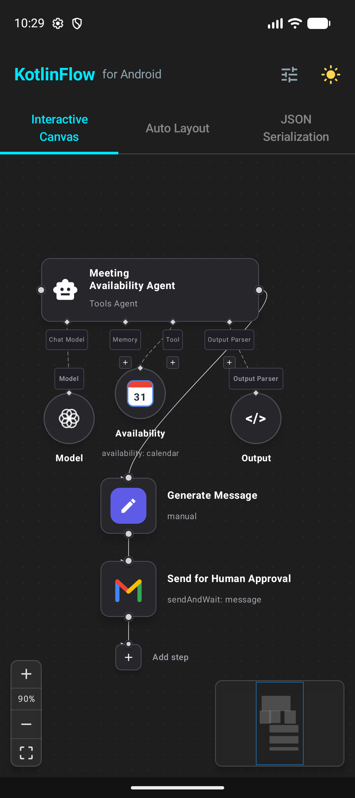
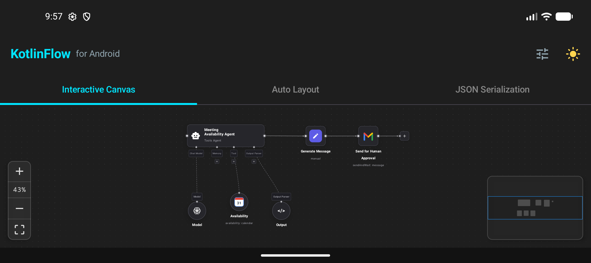
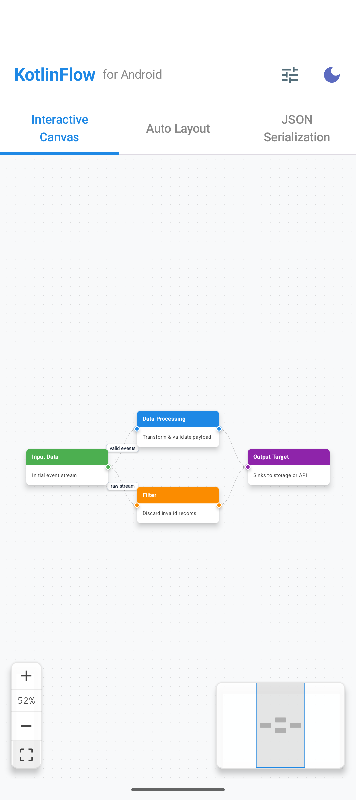
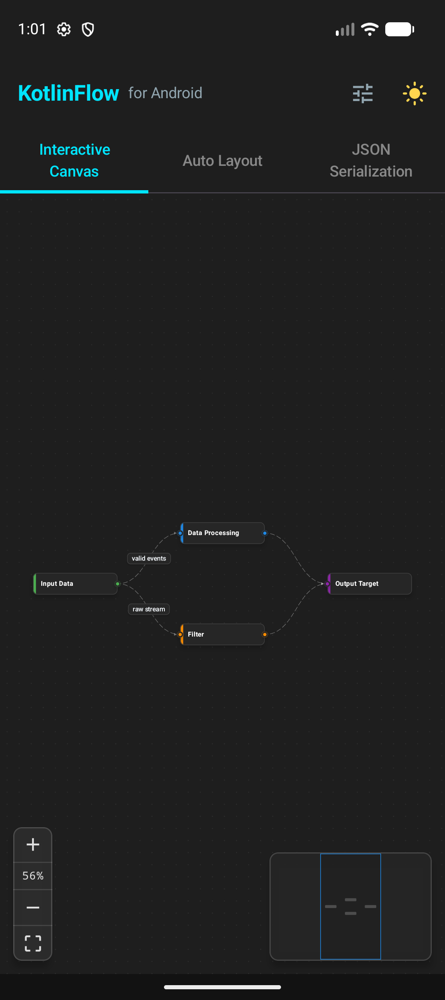
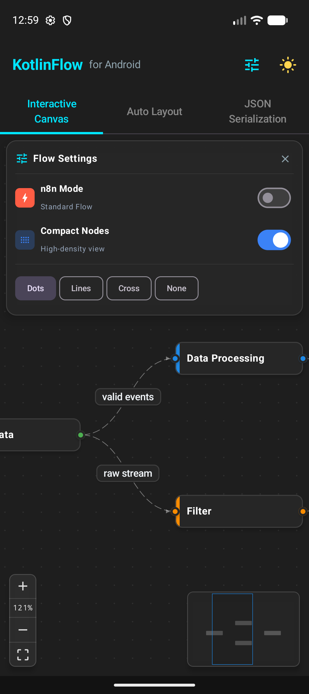
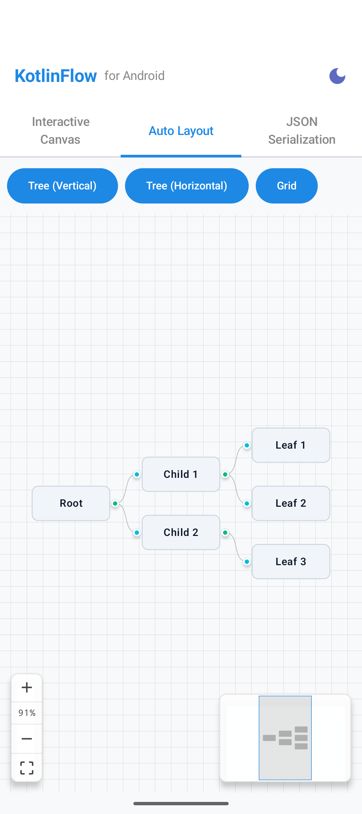

# KotlinFlow

<p align="left">
  <a href="https://central.sonatype.com/artifact/io.github.joaonart/kotlinflow"></a>
  <a href="https://kotlinlang.org"></a>
  <a href="https://developer.android.com/jetpack/compose"></a>
  <a href="LICENSE"></a>
  <a href="AGENTS.md"></a>
</p>

> A faithful, highly optimized Android port of [SwiftFlow](https://github.com/aaurelions/SwiftFlow) by [@aaurelions](https://github.com/aaurelions) (and inspired by ReactFlow) built natively with **Jetpack Compose**.

KotlinFlow brings full-featured node-based graph editing to Android apps. Designed with 1:1 parity with SwiftFlow, it provides smooth gesture interactions, interactive node dragging, connection routing, customizable handles, multi-algorithm auto-layout, minimap navigation, and JSON serialization.

---

## Visual Showcase

Experience KotlinFlow running natively on Android with hardware-accelerated pan & zoom, custom node cards, auto-layout algorithms, and dynamic light/dark theming:

| **n8n Workflow (Vertical / Mobile-First)** | **n8n Workflow (Horizontal Canvas)** |
|:---:|:---:|
|  |  |
| *Vertical top-to-bottom pipeline optimized for mobile portrait screens with branch routing* | *Full horizontal canvas view with execution status badges, metric pills & bezier curves* |

| **Interactive Canvas (Light Mode)** | **High-Density Compact Nodes** |
|:---:|:---:|
|  |  |
| *Standard DAG flow with connection handles, edge labels, MiniMap & Controls* | *High-density layout ideal for complex pipelines and microservice architectures* |

| **Live Flow Settings & Background Patterns** | **Automatic Graph Layout Engine** |
|:---:|:---:|
|  |  |
| *Interactive settings panel with live grid pattern toggles (Dots, Lines, Cross, None)* | *Hierarchical Tree (L-to-R / T-to-B), Grid, and physics-based Force-Directed layout* |

---

## Features

- **1:1 SwiftFlow API Parity**: Includes direct `SwiftFlow*` aliases (`SwiftFlow`, `SwiftFlowState`, `SwiftFlowStore`, `SwiftFlowInstance`, `SwiftFlowTheme`, `SwiftFlowDocument`, `FlowEdge`) for seamless code porting and mental model continuity.
- **Native Jetpack Compose Canvas**: Built from the ground up for Compose with hardware-accelerated smooth canvas rendering, hardware layering, and minimal recompositions.
- **Fluid Gestures & Viewport Navigation**:
  - Pinch-to-zoom and double-tap zoom with customizable limits (`[minZoom, maxZoom]`).
  - Two-finger / one-finger pan with optional canvas bounds clamping.
  - Programmatic camera controls: `fitView()`, `zoomIn()`, `zoomOut()`, `setCenter()`, `project()`, and `screenToFlowPosition()`.
- **Node Interactions**:
  - Drag-and-drop with real-time positional updates.
  - Configurable grid snapping (`snapToGrid = true`, `snapGrid = Pair(20f, 20f)`).
  - Node selection, multi-selection, dragging flags, deletion handling, and extent boundaries (`PARENT` or custom rect).
- **Flexible Edge System**:
  - Edge routing types: **Bezier**, **Straight**, **Step**, **SmoothStep**, and **SimpleBezier**.
  - Interactive connection dragging: drag from any output handle to an input handle with live snap indicator and custom validation rules (`isValidConnection`).
  - Edge styling: custom colors, stroke widths, animated dashed lines, and arrow markers (`ARROW`, `ARROW_CLOSED`).
  - Edge labels with custom rendering support (`EdgeLabelRenderer` and `EdgeText`).
- **Complete Suite of Graph Components**:
  - `Handle`: Source and target connection pins with configurable positions (`TOP`, `BOTTOM`, `LEFT`, `RIGHT`) and connection limit constraints.
  - `Background`: Built-in canvas patterns: **Dots**, **Lines**, **Cross**, and **None** with dynamic scale and gap synchronization.
  - `Controls` & `ControlButton`: Floating zoom in/out, fit view, and interactive mode toggles.
  - `MiniMap`: Interactive overview thumbnail with real-time node positions and draggable viewport window.
  - `Panel`: Overlay panels positioned at `TOP_LEFT`, `TOP_RIGHT`, `BOTTOM_LEFT`, or `BOTTOM_RIGHT`.
  - `NodeToolbar` & `EdgeToolbar`: Floating contextual action bars aligned above/below selected nodes and edges.
  - `NodeResizer`: Draggable 8-direction bounding box handles for dynamic node resizing.
  - `ViewportPortal`: Render arbitrary Jetpack Compose components anchored in graph coordinate space.
- **Rich Visual Modes**:
  - **n8n Automation Workflows**: Specialized automation cards featuring execution status indicators (Listening, Success, Evaluated, Sent), execution duration metrics, item counts, and status pills. Supports both **Vertical (top-to-bottom, mobile-optimized)** and **Horizontal (wide canvas)** orientations with dynamic handle repositioning (`TOP`/`BOTTOM` vs `LEFT`/`RIGHT`).
  - **High-Density Compact Nodes**: Compact representation for dense enterprise topologies and extensive decision trees.
  - **Dynamic Theming**: Seamless switching between **Light** and **Dark** color modes with adaptive node borders, shadow elevation, and connection handle contrast.
- **Built-in Auto Layout Engine**:
  - **Tree Layout**: Breadth-First Search layout supporting `TOP_TO_BOTTOM`, `BOTTOM_TO_TOP`, `LEFT_TO_RIGHT`, and `RIGHT_TO_LEFT` hierarchies.
  - **Force-Directed Layout**: Dynamic physics simulation using Coulomb electrostatic repulsion and Hooke spring attraction.
  - **Grid Layout**: Automatic uniform matrix arrangement.
- **JSON Graph Serialization**:
  - Full serialization of graph documents via `KotlinFlowDocument` using `kotlinx.serialization`.
  - Helper utilities: `toJSON()`, `toJSONString()`, `fromJSON()`, and `fromJSONString()`.
- **AI Agent & LLM Ready**:
  - Detailed system prompt instructions, architectural conventions, and code templates for AI coding assistants (Claude Code, Codex, Cursor, Gemini CLI) in [AGENTS.md](AGENTS.md).

---

## Modules

- **`:kotlinflow`**: The core library module containing all models, algorithms, math utilities, state containers, and Compose UI components.
- **`:app`**: An interactive sample application showcasing:
  1. *Interactive Canvas*: Custom node types, connection drafting, background pattern switching, minimap, and floating controls.
  2. *Auto Layout*: Live switching between Tree (Vertical/Horizontal), Grid, and Force-Directed physics.
  3. *Serialization*: Live JSON export and import of complete graph topologies.

---

## Installation

### Option 1: Maven Central (Recommended)

KotlinFlow is available on **Maven Central**. Add the dependency to your module's `build.gradle.kts`:

```kotlin
// app/build.gradle.kts
dependencies {
    implementation("io.github.joaonart:kotlinflow:1.0.0")
}
```

### Option 2: JitPack (Instant Open-Source & CI Builds)

Add the JitPack repository to your root `settings.gradle.kts`:

```kotlin
dependencyResolutionManagement {
    repositories {
        google()
        mavenCentral()
        maven { url = uri("https://jitpack.io") }
    }
}
```

Add the dependency to your module's `build.gradle.kts`:

```kotlin
dependencies {
    implementation("com.github.joaonart.KotlinFlow:kotlinflow:v1.0.0")
}
```

### Option 3: GitHub Packages

Add the GitHub Packages repository to your root `settings.gradle.kts`:

```kotlin
dependencyResolutionManagement {
    repositories {
        google()
        mavenCentral()
        maven {
            url = uri("https://maven.pkg.github.com/joaonart/KotlinFlow")
            credentials {
                username = System.getenv("GITHUB_ACTOR") ?: providers.gradleProperty("gpr.user").orNull ?: ""
                password = System.getenv("GITHUB_TOKEN") ?: providers.gradleProperty("gpr.key").orNull ?: ""
            }
        }
    }
}
```

Add the dependency to your module's `build.gradle.kts`:

```kotlin
dependencies {
    implementation("com.github.joaonart:kotlinflow:1.0.0")
}
```

### Option 4: Composite Build (Recommended for Local App Development)

If you are developing your app alongside KotlinFlow, use a Gradle composite build in your `settings.gradle.kts` for instant hot-reloading and source navigation:

```kotlin
// settings.gradle.kts
includeBuild("path/to/KotlinFlow")
```

```kotlin
// app/build.gradle.kts
dependencies {
    implementation("com.github.joaonart:kotlinflow")
}
```

### Option 5: Git Submodule / Project Dependency

```bash
git submodule add https://github.com/joaonart/KotlinFlow.git
```

```kotlin
// settings.gradle.kts
include(":kotlinflow")
project(":kotlinflow").projectDir = file("KotlinFlow/kotlinflow")

// app/build.gradle.kts
dependencies {
    implementation(project(":kotlinflow"))
}
```

Ensure your project uses Java 17 or Java 21 LTS and has the Jetpack Compose compiler enabled:

```kotlin
android {
    compileSdk = 35

    defaultConfig {
        minSdk = 24
    }

    compileOptions {
        sourceCompatibility = JavaVersion.VERSION_17
        targetCompatibility = JavaVersion.VERSION_17
    }

    kotlinOptions {
        jvmTarget = "17"
    }

    buildFeatures {
        compose = true
    }
}
```

---

## Quick Start

### 1. Minimal Graph Example

```kotlin
import androidx.compose.foundation.layout.fillMaxSize
import androidx.compose.runtime.Composable
import androidx.compose.runtime.remember
import androidx.compose.ui.Modifier
import io.github.kotlinflow.components.KotlinFlow
import io.github.kotlinflow.components.Background
import io.github.kotlinflow.components.Controls
import io.github.kotlinflow.components.MiniMap
import io.github.kotlinflow.models.Edge
import io.github.kotlinflow.models.EdgeType
import io.github.kotlinflow.models.Node
import io.github.kotlinflow.models.XYPosition
import io.github.kotlinflow.state.rememberKotlinFlowState
import io.github.kotlinflow.types.BackgroundVariant
import io.github.kotlinflow.types.Position

@Composable
fun FlowchartScreen() {
    val initialNodes = remember {
        listOf(
            Node(
                id = "1",
                position = XYPosition(100f, 150f),
                width = 160f,
                height = 70f,
                data = "Start Node"
            ),
            Node(
                id = "2",
                position = XYPosition(350f, 150f),
                width = 160f,
                height = 70f,
                data = "Process Node"
            )
        )
    }

    val initialEdges = remember {
        listOf(
            Edge(
                id = "e1-2",
                source = "1",
                target = "2",
                sourceHandle = Position.RIGHT.name.lowercase(),
                targetHandle = Position.LEFT.name.lowercase(),
                type = EdgeType.SMOOTHSTEP,
                animated = true
            )
        )
    }

    val state = rememberKotlinFlowState(
        initialNodes = initialNodes,
        initialEdges = initialEdges
    )

    KotlinFlow(
        state = state,
        modifier = Modifier.fillMaxSize(),
        snapToGrid = true,
        background = {
            Background(variant = BackgroundVariant.DOTS)
        },
        controls = {
            Controls()
        },
        miniMap = {
            MiniMap()
        }
    )
}
```

### 2. Custom Node Rendering with Handles

```kotlin
import androidx.compose.foundation.background
import androidx.compose.foundation.border
import androidx.compose.foundation.layout.Box
import androidx.compose.foundation.layout.fillMaxSize
import androidx.compose.foundation.layout.padding
import androidx.compose.foundation.shape.RoundedCornerShape
import androidx.compose.material3.Text
import androidx.compose.ui.Alignment
import androidx.compose.ui.graphics.Color
import androidx.compose.ui.unit.dp
import io.github.kotlinflow.components.Handle
import io.github.kotlinflow.types.HandleType
import io.github.kotlinflow.types.Position

KotlinFlow(
    state = state,
    modifier = Modifier.fillMaxSize(),
    nodeContent = { node ->
        Box(
            modifier = Modifier
                .fillMaxSize()
                .background(Color.White, RoundedCornerShape(12.dp))
                .border(2.dp, if (node.selected) Color(0xFF6366F1) else Color(0xFFE2E8F0), RoundedCornerShape(12.dp))
                .padding(12.dp),
            contentAlignment = Alignment.Center
        ) {
            // Target Handle on Left
            Handle(
                type = HandleType.TARGET,
                position = Position.LEFT,
                nodeId = node.id
            )

            Text(text = node.data?.toString() ?: node.id)

            // Source Handle on Right
            Handle(
                type = HandleType.SOURCE,
                position = Position.RIGHT,
                nodeId = node.id
            )
        }
    }
)
```

### 3. Automatic Layout

```kotlin
import io.github.kotlinflow.utils.AutoLayoutOptions
import io.github.kotlinflow.utils.AutoLayoutType
import io.github.kotlinflow.utils.TreeDirection

// Apply hierarchical tree layout
state.applyLayout(
    AutoLayoutOptions(
        type = AutoLayoutType.TREE,
        direction = TreeDirection.TOP_TO_BOTTOM,
        nodeSpacing = 50f,
        rankSpacing = 80f
    )
)

// Center and frame all nodes
state.fitView()
```

### 4. JSON Serialization

```kotlin
import io.github.kotlinflow.utils.KotlinFlowDocument
import io.github.kotlinflow.utils.toJSONString
import io.github.kotlinflow.utils.fromJSONString

// Export current graph to JSON
val document = KotlinFlowDocument.fromState(state)
val jsonString = document.toJSONString()

// Restore graph from JSON
val importedDoc = KotlinFlowDocument.fromJSONString(jsonString)
importedDoc.applyToState(state)
```

---

## SwiftFlow to KotlinFlow Migration Guide

KotlinFlow is designed with direct 1:1 mapping with SwiftFlow on iOS:

| SwiftFlow (iOS / Swift) | KotlinFlow (Android / Kotlin) | Description |
|---|---|---|
| `SwiftFlow(...)` | `KotlinFlow(...)` / `SwiftFlow(...)` | Canvas view composable |
| `SwiftFlowState` | `KotlinFlowState` / `SwiftFlowState` | Reactive graph state container |
| `SwiftFlowStore` | `KotlinFlowStore` / `SwiftFlowStore` | Centralized state store |
| `SwiftFlowInstance` | `KotlinFlowInstance` / `SwiftFlowInstance` | Programmatic viewport controller |
| `SwiftFlowProvider` | `KotlinFlowProvider` / `SwiftFlowProvider` | Context / CompositionLocal provider |
| `SwiftFlowTheme` | `KotlinFlowTheme` / `SwiftFlowTheme` | Color scheme tokens (Default, Dark, Light) |
| `SwiftFlowDocument` | `KotlinFlowDocument` / `SwiftFlowDocument` | Serializable document model |
| `Node<Data>` | `Node<T>` | Generic node data class |
| `Edge<Data>` | `Edge<T>` / `FlowEdge<T>` | Generic edge data class |
| `XYPosition(x, y)` | `XYPosition(x, y)` | 2D coordinate vector with grid snapping |
| `Handle` | `Handle` | Input/Output connection pin |
| `Background` | `Background` | Dots, Lines, and Cross background grid |
| `Controls` | `Controls` | Floating zoom & fit action controls |
| `MiniMap` | `MiniMap` | Real-time interactive thumbnail minimap |
| `NodeToolbar` | `NodeToolbar` | Contextual toolbar anchored to nodes |
| `EdgeToolbar` | `EdgeToolbar` | Contextual toolbar anchored to edge midpoints |
| `NodeResizer` | `NodeResizer` | 8-handle node resize bounding box |
| `EdgeLabelRenderer` | `EdgeLabelRenderer` | Overlay renderer for edge labels |
| `ViewportPortal` | `ViewportPortal` | Viewport-transformed arbitrary content |
| `computeAutoLayout(...)` | `computeAutoLayout(...)` | Layout algorithms (Tree, Force, Grid) |

---

## Testing & Quality Assurance

KotlinFlow includes an extensive test suite covering models, algorithms, geometric math, state transitions, and serialization.

Run unit tests via Gradle:

```bash
export JAVA_HOME=/Library/Java/JavaVirtualMachines/temurin-21.jdk/Contents/Home
./gradlew :kotlinflow:test
```

Run test verification with reports:

```bash
./gradlew test --info
```

Build the sample application APK:

```bash
./gradlew :app:assembleDebug
```

---

## Acknowledgments & Credits

Special thanks to **[Aurelion](https://github.com/aaurelions)** ([@aaurelions](https://github.com/aaurelions)) for creating and open-sourcing **[SwiftFlow](https://github.com/aaurelions/SwiftFlow)**. The elegant API architecture, robust geometric foundations, and intuitive developer experience of SwiftFlow served as the primary blueprint and direct inspiration for KotlinFlow, enabling seamless parity between iOS and Android graph editing experiences.

---

## License

This project is licensed under the MIT License - see the [LICENSE](LICENSE) file for details.
